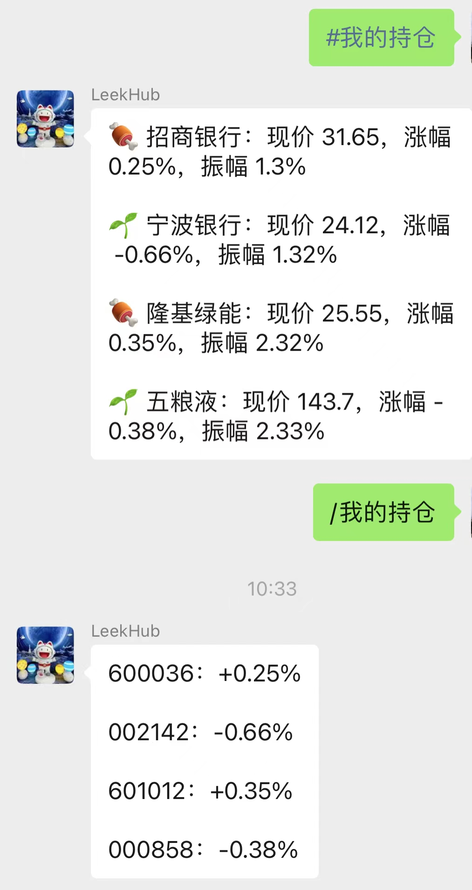
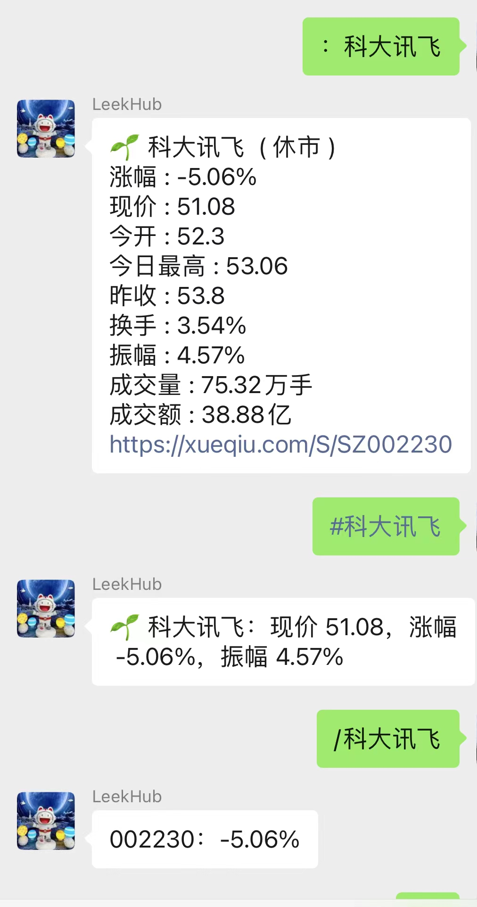

# wechat-autoreply

web微信自动回复，（web微信！！！非微信公众号，不管是在微信群聊还是微信私聊中，触发关键词，都会出现自动回复）


## Feature

- 回复：`giscafer助手` 可查看功能使用说明

- 支持微信图片搜索，自动回复图片

关键字 `图 xxx`，比如要搜索`篮球`，回复：`图 篮球`，搜索新垣结衣，回复：`图 新垣结衣`

- 词典翻译，支持中文与英、日、韩三种互译

中文翻译英文回复 `中译英 中国`，英文翻译中文回复：`英译中 China`，`中译日 你好`，`日译中 こんにちは`，`中译韩 你好`，`韩译中 안녕하세요`；

- 查询宋词，随机宋词回复 `查宋词`，指定宋词回复 `查宋词 退宫妓`，根据词人搜索回复 `查宋词 王之道`

- 查询唐诗，随机宋词回复 `查唐诗`，指定唐诗回复 `查唐诗 春晓`，根据诗人搜索回复 `查唐诗 李白`

- 查招聘行情信息，回复 `查招聘行情`

- 查询台风信息，回复 `查台风`

- 查询天气信息，回复 `查天气 城市名称`，如`查天气 广州`

- 查询ip归属地信息，回复 `查ip ip`，如 `查ip 221.193.207.29`

- 关键词自动回复有：`query电话号码`等……

- ……（持续更新）


### Tips

如果诗词很多找不到，可能是代码`./modules/poetry.js` 诗词的数量设置小了，内存够的同学可以放开（>3G），最大见注释

```
// 诗词数量加载控制
let songLen = 254; //宋词，最大254
let tangLen = 58; //唐诗，最大58
```

## Usage

- npm install
- node index 

运行后扫描二维码登录微信即可

## Screenshot

**不管是在微信群聊还是微信私聊中，触发关键词，都会出现自动回复**

 

 




## Relation


- 微信接口基于 [wechat4u](https://github.com/nodeWechat/wechat4u)

- 唐诗56591首、宋词251000首，数据来源于 [chinese-poetry](https://github.com/chinese-poetry/chinese-poetry)


## License
MIT

---

> [giscafer.com](http://giscafer.com) &nbsp;&middot;&nbsp;
> GitHub [@giscafer](https://github.com/giscafer) &nbsp;&middot;&nbsp;
> Weibo [@Nickbing Lao](https://weibo.com/laohoubin)
